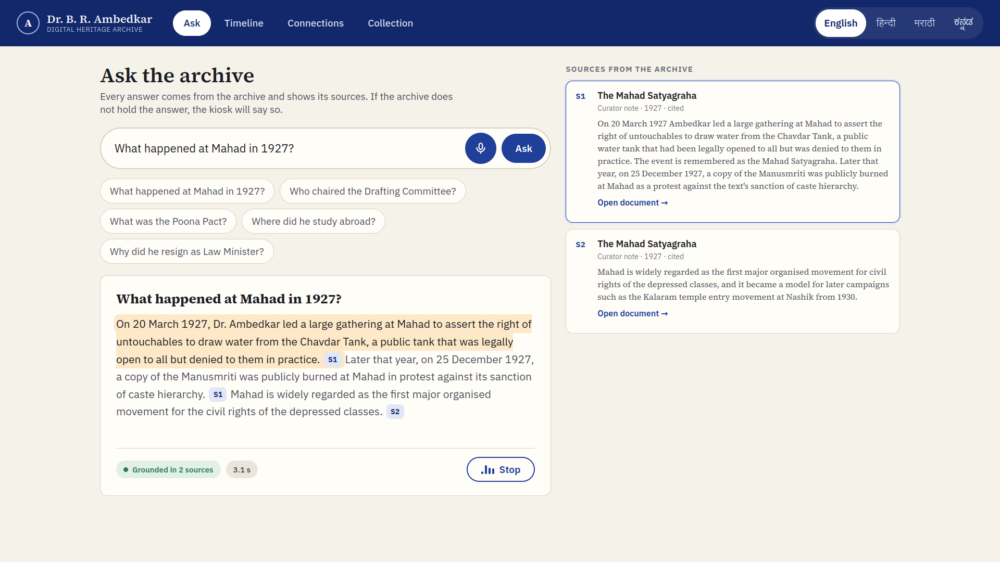
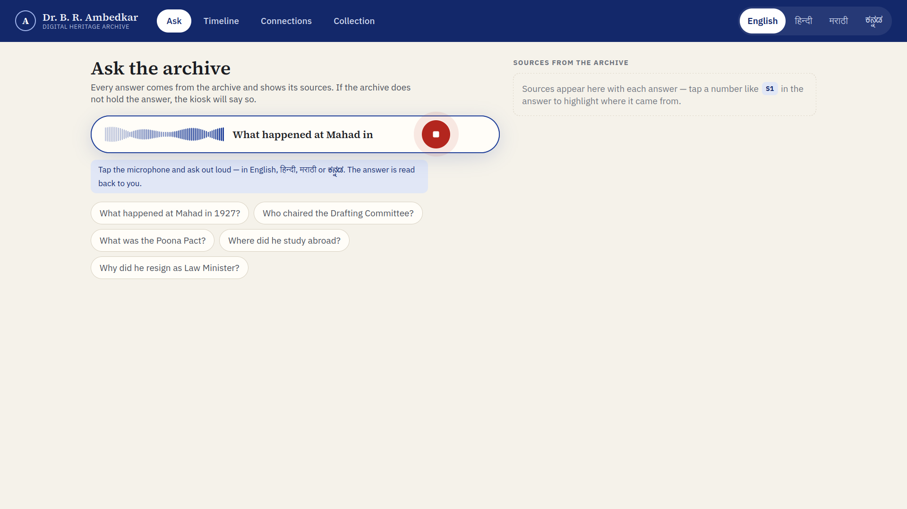
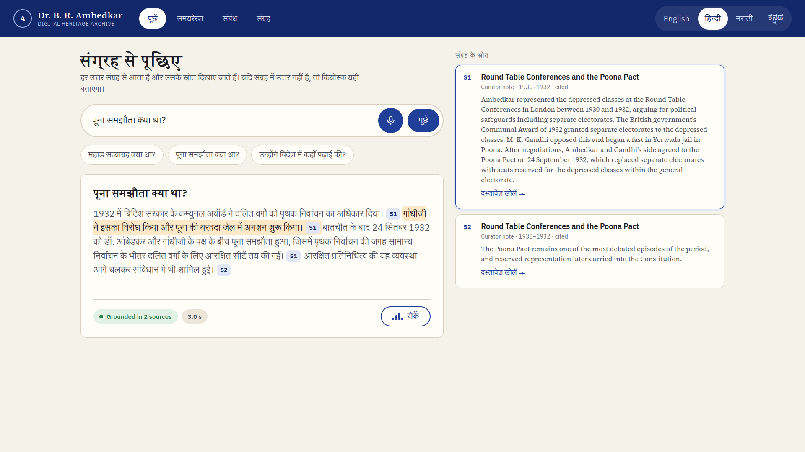
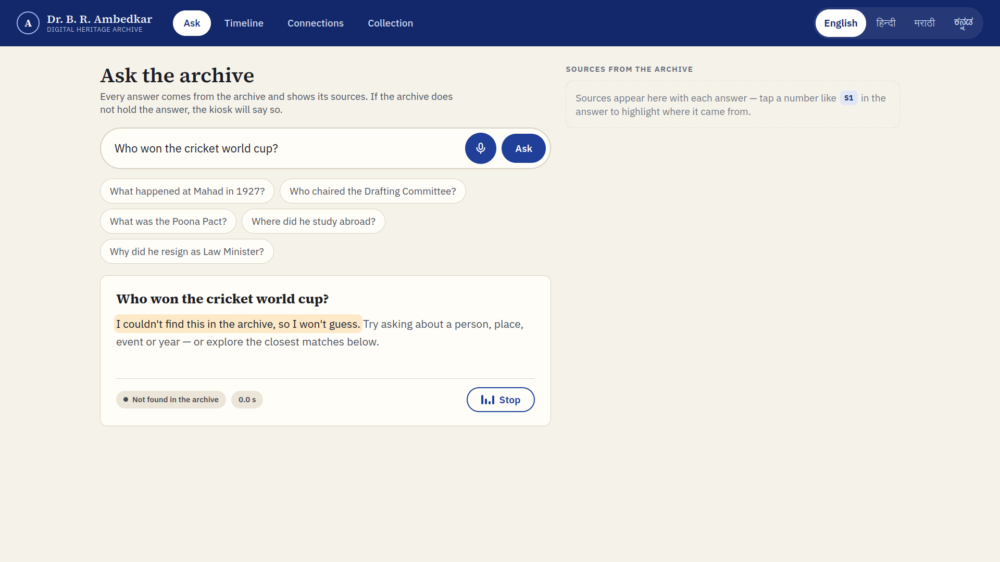
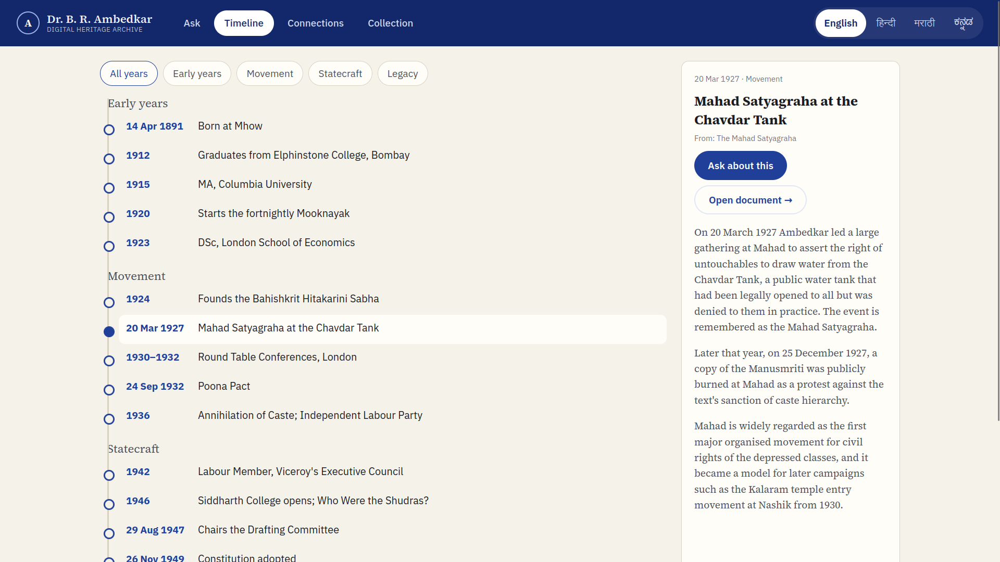
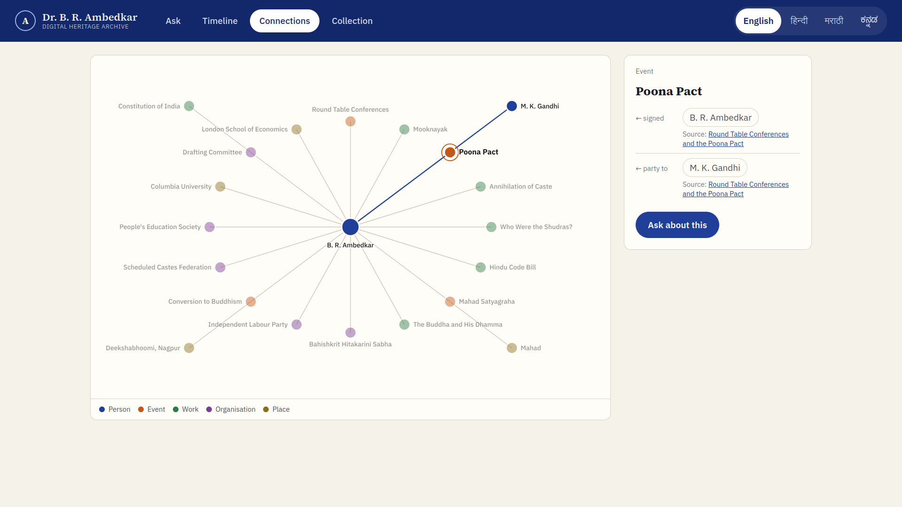
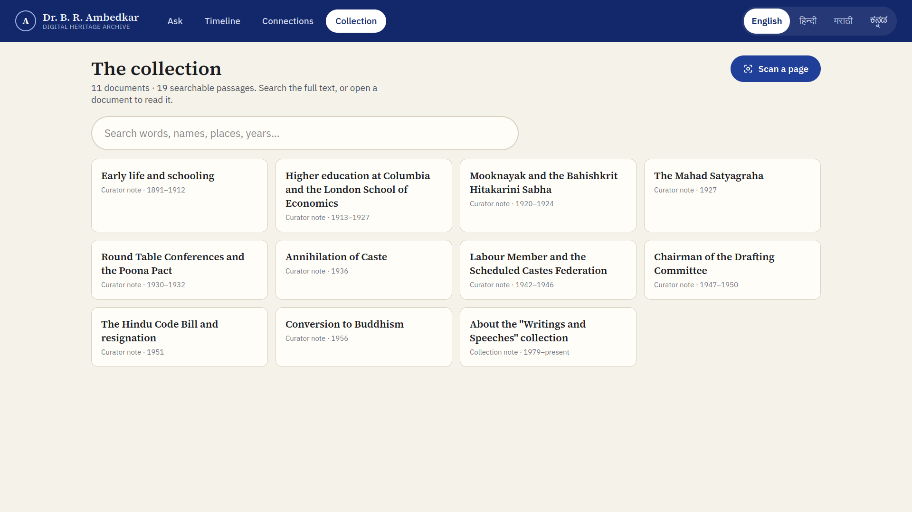
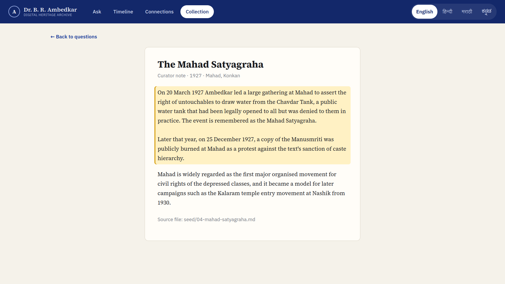
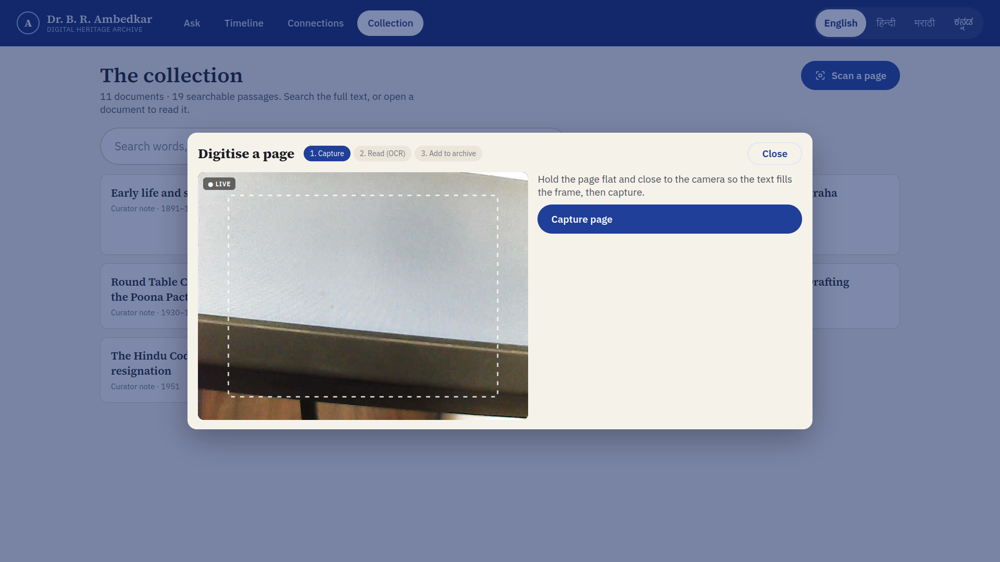
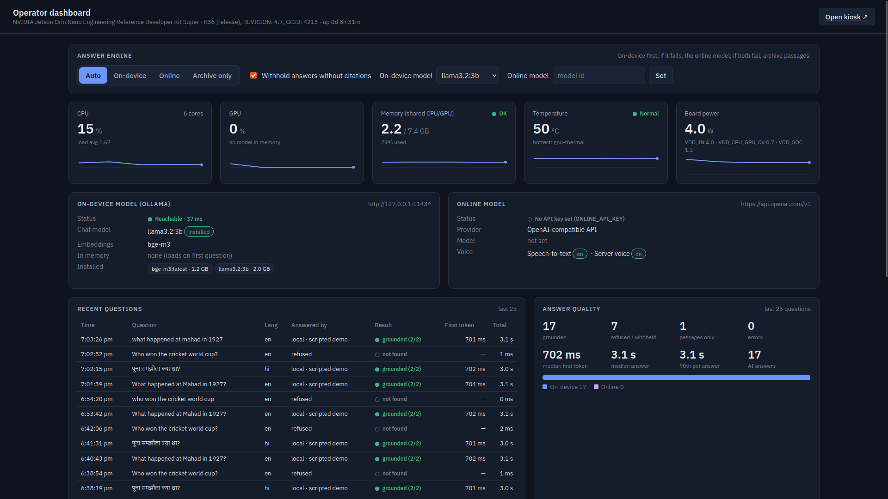

# Samvira — Ambedkar Digital Heritage Archive kiosk

Samvira is a museum kiosk that lets any visitor ask questions about Dr. B. R. Ambedkar's life and writings, by voice or by typing, in **English, Hindi, Marathi or Kannada**, and get an answer that shows exactly where it came from. It runs entirely on an **NVIDIA Jetson Orin Nano**, with no internet needed.

- **Kiosk** (`http://localhost:3000`): the touch screen visitors use, built for a 1920×1080 display.
- **Operator dashboard** (`http://localhost:3000/admin`): live Jetson telemetry, model status, answer quality, engine switching and re-indexing.

🎬 **[Watch the 2-minute demo](docs/samvira-demo.mp4)** (recorded on the Jetson; see [Demo mode](#demo-mode))



---

## Features

### Ask the archive, with citations
Every answer is built only from passages retrieved from the archive. Each sentence carries a tappable `S1`, `S2` chip. Tapping it highlights the source card, and **Open document** jumps to the exact passage in the reader (with page numbers for PDFs).

### Ask by voice, answered aloud
Tap the mic and speak. A live waveform and caption show the kiosk listening, and recording stops on its own when you pause. Speech is recognised on the device (Whisper on the Orin GPU). The answer is read aloud by an on-device neural voice (Piper), **sentence by sentence while it is still being written**. The sentence being read is highlighted, and so is the source card it cites.

 

### Four languages, detected from speech
English, हिन्दी, मराठी and ಕನ್ನಡ for the interface and the answers. Speak Hindi, Marathi or Kannada and the kiosk **switches to that language by itself**. The archive is in English, and multilingual embeddings (BGE-M3) match a Hindi question to the right English passages.

### Cite or refuse
If search finds nothing relevant, the kiosk says so **before calling any model** (in about 0.2 s), and says it aloud. If a model ever answers without citations, that answer is withheld and never spoken.



### Timeline and connections
A chronology of his life (18 events in four eras, filterable) and a network of the people, events, works, organisations and places around him. Every item names its source document and has **Ask about this**.

 

### Collection, full-text search and reader
Browse every document, search the full text of every passage as you type, and read documents with the cited passage highlighted.

 

### Digitise a page with the camera (OCR)
**Collection → Scan a page** shows the Jetson's webcam live. Capture a page, and it is read on the device with Tesseract OCR (English, Hindi, Marathi, Kannada), shown for review, and added to the archive in about 2.5 s, searchable and citable straight away. The reader shows the original photo above its text. Scanned PDFs dropped into `data/docs/` go through the same OCR, page by page.



### Operator dashboard
Live CPU, GPU, shared memory, temperature and board power with 2-minute history; on-device and online model status; the answer engine switch (**Auto**: on-device → online → archive passages; **On-device**; **Online**; **Archive only**, which needs no model at all); answer-quality statistics; recent questions; a side-by-side on-device vs online benchmark; and one-click re-indexing.



### Also
- **Works offline.** Every model runs on the board; "Archive only" mode needs no model.
- **Idle reset.** After 2 minutes without a touch the kiosk clears the conversation and returns to the start screen.
- **Models stay warm.** The chat model, embedder and Whisper load at server start, so the first visitor doesn't wait.

---

## Models and measured performance

| Job | Model | Runs on |
|---|---|---|
| Writing answers | Llama 3.2 3B (4-bit, via Ollama) | GPU |
| Cross-language search | BGE-M3 embeddings (568M parameters, 1024 dimensions) | CPU, ~0.2 s per question |
| Speech to text | Whisper small (8-bit, whisper.cpp + CUDA) | GPU |
| Text to speech | Piper neural voices (English, Hindi) | CPU |
| OCR | Tesseract 4.1 (English, Hindi, Marathi, Kannada) | CPU |

Measured on the Orin Nano 8 GB (25 W mode) with the live pipeline: speech → text **1.2–1.4 s**; first word of an answer **~1 s** later; full English answer **~4 s**; Hindi answers **4–9 s**; off-topic refusal **0.19 s**; OCR **~1.4 s per scanned page**. Kannada answers are much slower (~26 s) and weaker with a 3B model.

The embedder runs on the CPU on purpose: on 8 GB of shared memory, the GPU can't hold the chat model, the embedder and Whisper together.

---

## Demo mode

`DEMO_MODE=1` in `.env.local` turns the kiosk into a lightweight, predictable presentation that needs **no models, microphone or speech servers** (the web server alone, ~2 GB of memory):

- Each mic tap silently "hears" the next scripted question (waveform and caption, no sound): *What happened at Mahad in 1927?* → *पूना समझौता क्या था?* (the kiosk switches to Hindi) → *Who won the cricket world cup?* (refused).
- The scripted questions get **pre-written answers** built from the archive passages (`src/lib/demo.ts`), streamed and read aloud from pre-rendered audio in `data/demo-audio/`. Other questions get matching archive passages. Present these as prepared examples of what the system produces, not as live generation.
- `scripts/record-demo.sh` drives the kiosk on the monitor and records a demo video (screen captured with the Orin's hardware JPEG encoder, audio from the monitor's speaker). `scripts/screenshots.sh` regenerates the screenshots in this README.

After editing `src/lib/demo.ts`, re-render the audio with the Piper server running: `curl -X POST localhost:3000/api/admin/demo-audio`. Set `DEMO_MODE=0` for the live kiosk.

---

## About the bundled content

`data/seed/` holds 11 short **curator notes** written as demo content: plain summaries of well-documented events, with no quotations. They exist so the demo works out of the box. **Before any public showing, replace or verify them** against the primary source. The real corpus is *Dr. Babasaheb Ambedkar: Writings and Speeches* (Government of Maharashtra), which is available as scans on the Internet Archive. Put those PDFs in `data/docs/` and re-index; scanned pages are read with OCR.

`data/timeline.json` and `data/graph.json` are built from the same notes. Edit them to add events and relationships; each entry names the document it comes from.

The Hindi, Marathi and Kannada interface text, refusal messages and the scripted Hindi answer are a first draft. **Have a native speaker review them.**

---

## Setting it up on the Jetson Orin Nano

Tested flow assumes **JetPack 6 (Ubuntu 22.04)**. Commands run on the Jetson.

### 1. System packages

```bash
sudo apt update
sudo apt install -y git curl poppler-utils fonts-noto-core   # pdftotext for PDFs, Devanagari/Kannada fonts
```

For the browser's built-in "read aloud" voice in Indian languages, also install `speech-dispatcher espeak-ng`.

### 2. Node.js 22

```bash
curl -o- https://raw.githubusercontent.com/nvm-sh/nvm/v0.40.1/install.sh | bash
source ~/.bashrc
nvm install 22
```

### 3. Ollama and models (the on-device engine)

```bash
curl -fsSL https://ollama.com/install.sh | sh     # detects the Jetson and installs the GPU build
ollama pull llama3.2:3b                             # chat model — fits comfortably in 8 GB shared memory
ollama pull bge-m3                                  # multilingual embeddings for Hindi/Marathi/Kannada search
```

Any other Ollama model works. Change `LOCAL_CHAT_MODEL`, or pick it from the dashboard drop-down. On 8 GB, stay around 3–4B parameters at 4-bit so the chat model, the embedding model and the browser all fit together. For the best response times, put the board in its highest power mode: check the modes with `sudo nvpmodel -q`, then run `sudo jetson_clocks`.

### 4. The app

```bash
git clone <your repo> ~/heritage-kiosk     # or copy this folder over
cd ~/heritage-kiosk
cp .env.example .env.local                   # then edit — see below
npm install
npm run build                                # needs internet once (downloads the web fonts)
npm start                                    # http://localhost:3000  and  /admin
```

On first start the app builds a keyword index from `data/seed`. To add embeddings and your PDFs:

```bash
cp ~/Downloads/*.pdf data/docs/
npm run ingest            # or press "Re-index archive" on /admin
```

### 5. Online model (optional)

In `.env.local`:

```ini
# Any OpenAI-compatible API (OpenAI, Groq, OpenRouter, Together, Gemini's OpenAI endpoint…)
ONLINE_PROVIDER=openai
ONLINE_BASE_URL=https://api.openai.com/v1
ONLINE_API_KEY=sk-...
ONLINE_CHAT_MODEL=<a model your key can use>

# or Claude
ONLINE_PROVIDER=anthropic
ONLINE_API_KEY=sk-ant-...
ONLINE_CHAT_MODEL=<a Claude model id>
```

Leave `ANSWER_MODE=auto` to get on-device first with online fallback.

### 6. Voice (optional)

**On-device setup (what this prototype uses).** Everything lives in `../voice/`, next to this folder, and runs offline:

```bash
# speech-to-text: whisper.cpp on the Orin GPU (build takes ~1 h on the board)
git clone --depth 1 https://github.com/ggml-org/whisper.cpp ../voice/whisper.cpp
cd ../voice/whisper.cpp && PATH=/usr/local/cuda/bin:$PATH cmake -B build -DGGML_CUDA=1 -DCMAKE_CUDA_ARCHITECTURES=87 -DCMAKE_BUILD_TYPE=Release
cmake --build build -j5 --target whisper-server && cd ..
curl -L -o models/ggml-small-q8_0.bin https://huggingface.co/ggerganov/whisper.cpp/resolve/main/ggml-small-q8_0.bin
# text-to-speech: Piper neural voices (CPU)
uv venv tts-venv && uv pip install -p tts-venv/bin/python piper-tts
#   put en_US-lessac-medium and hi_IN-pratham-medium (.onnx + .onnx.json) from huggingface.co/rhasspy/piper-voices in piper-voices/
./start-voice.sh     # STT on :8178, TTS on :8179  (or install deploy/heritage-voice.service)
```

Then set `STT_URL=http://127.0.0.1:8178` and `TTS_URL=http://127.0.0.1:8179` in `.env.local`.

What visitors get: tap the mic, speak, and a live waveform shows the kiosk is listening. Recording stops by itself when they pause. In English mode the spoken language is detected (English, Hindi, Marathi or Kannada), and the kiosk switches to it. Spoken questions are answered aloud, sentence by sentence while the answer is still being written. The sentence being read is highlighted, and so are the source cards it cites. Speech starts only once the answer has cited a real source, so a withheld answer is never read out. Marathi is read with the Hindi voice. Kannada has no Piper voice, so it falls back to the browser's voice.

**Other servers** work too:

- **Speech-to-text:** set `STT_URL` to anything that serves the OpenAI `POST /audio/transcriptions` API. That can be an online API (`https://api.openai.com/v1` with `STT_MODEL=whisper-1` and `STT_API_KEY`), or a local Whisper server on the Jetson. *speaches* (formerly faster-whisper-server) is one OpenAI-compatible option. Check its docs for an ARM64/Jetson build before you rely on it. The mic button only appears when `STT_URL` is set.
- **Read aloud:** by default this uses the browser's voice. To use a server voice instead, set `TTS_URL` to anything that serves `POST /audio/speech`.

The microphone only works on `localhost` or HTTPS. The kiosk runs on `localhost`, so it's fine on the device.

### 7. OCR and camera (optional)

OCR uses Tesseract. With sudo: `sudo apt install tesseract-ocr tesseract-ocr-hin tesseract-ocr-mar tesseract-ocr-kan` and set `OCR_CMD=tesseract`. Without sudo, unpack Ubuntu's packages next to this folder (this is what the prototype does):

```bash
mkdir -p ../tools/ocr/debs && cd ../tools/ocr/debs && apt-get download tesseract-ocr libtesseract4 liblept5
cd .. && for d in debs/*.deb; do dpkg -x $d root; done
mkdir -p tessdata && for l in eng hin mar kan osd; do curl -L -o tessdata/$l.traineddata https://github.com/tesseract-ocr/tessdata_fast/raw/main/$l.traineddata; done
# ../tools/ocr/tesseract.sh sets LD_LIBRARY_PATH and TESSDATA_PREFIX and runs root/usr/bin/tesseract
```

`OCR_LANGS` (default `eng+hin+mar`) picks the languages. The camera is any USB webcam (`CAMERA_DEVICE`, default `/dev/video0`; `CAMERA_SIZE`, default `640x480`), read on the server with ffmpeg, so the browser never asks for camera permission. At webcam resolution, hold the page close so the text fills the frame.

### 8. Start at boot, full-screen

```bash
sudo cp deploy/heritage-kiosk.service /etc/systemd/system/   # edit User/WorkingDirectory/ExecStart first
sudo systemctl daemon-reload && sudo systemctl enable --now heritage-kiosk
mkdir -p ~/.config/autostart && cp deploy/kiosk-browser.desktop ~/.config/autostart/
```

`scripts/kiosk.sh` waits for the server, disables screen blanking, sends sound to the monitor's built-in speaker (HDMI/DisplayPort audio) and opens Chromium in kiosk mode with the microphone pre-approved.

**Snap browsers on JetPack 6:** if Firefox or Chromium fails with `snap-confine is packaged without necessary permissions`, start it with `SNAP_REEXEC=0` (e.g. `SNAP_REEXEC=0 firefox --kiosk http://localhost:3000`).

Set `ADMIN_PIN` in `.env.local` so visitors can't change settings from `/admin`. The kiosk screens never link to it.

---

## How it works

```
Kiosk (browser) ──► Next.js on the Jetson
                     ├─ /api/ask ── retrieval (BM25 + bge-m3 vectors, in-process)
                     │              └─► prompt with numbered sources ─► Ollama (local)  ─┐
                     │                                                 └► online API ◄──┘ fallback
                     │              └─► cite-or-refuse check ─► streamed NDJSON to the kiosk
                     ├─ /api/transcribe ─► Whisper (whisper.cpp, GPU)    language detection + transcription
                     ├─ /api/tts ─► Piper voices (or pre-rendered demo audio)
                     ├─ /api/camera/* ─► webcam (ffmpeg) ─► OCR (Tesseract) ─► data/docs ─► re-index
                     ├─ /api/system ─► /proc + /sys (CPU, GPU load, temps, INA3221 power)
                     └─ /api/admin/ingest ─► pdftotext / OCR ─► chunks ─► embeddings ─► data/index.json + vectors.f32
```

No database is needed for the prototype: the index is a JSON file plus a binary vector file, loaded into memory. This keeps the Jetson footprint small. The full design's PostgreSQL + pgvector, Neo4j and MinIO slot in behind the same `/api/search` and `/api/ask` interfaces.

| Path | What's there |
|---|---|
| `src/lib/retrieval.ts` | BM25 + vector hybrid search, refusal threshold |
| `src/lib/providers.ts` | Ollama, OpenAI-compatible and Anthropic streaming clients, health checks |
| `src/lib/prompt.ts` | Grounding prompt, citation parsing, refusal text |
| `src/app/api/ask/route.ts` | Retrieve → generate → fallback chain → verdict |
| `src/lib/jetson.ts` | Hardware telemetry |
| `src/lib/corpus.ts` | PDF/text/image ingestion, OCR, chunking |
| `src/lib/speech.ts`, `src/lib/sentences.ts` | Sentence-by-sentence read-aloud while the answer streams |
| `src/lib/camera.ts` | Shared webcam capture for the live preview and "Capture" |
| `src/lib/demo.ts` | Demo mode: scripted questions and pre-written answers |
| `src/lib/warmup.ts` | Loads the models at server start |
| `src/components/` | Kiosk and dashboard UI |
| `../voice/` | Whisper and Piper servers (`start-voice.sh`) |

### Tuning

- `MIN_RETRIEVAL_SCORE` (default 1.5) and `MIN_VECTOR_SCORE` (default 0.55) decide when the kiosk says "not in the archive". Tune them on your real corpus: ask ten in-scope and ten out-of-scope questions and adjust until both sets behave.
- `TOP_K` (default 5) sets how many passages go to the model. Fewer passages means faster answers on the Jetson.
- The on-device model's context is set to 4096 tokens (`num_ctx` in `providers.ts`).

### Privacy note

Questions are logged, cut to 120 characters, to `data/querylog.jsonl` for the dashboard's statistics. Voice recordings are transcribed and discarded. Delete the log file or remove `recordQuery` if you don't want it.

The scan panel shows whatever is in front of the camera. Only the latest capture is kept (in `data/scans/`, which git ignores) until it is added to the archive or replaced.
